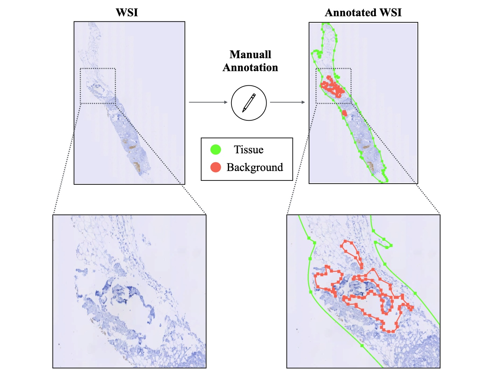

[](https://doi.org/10.5281/zenodo.14131968)

This repository is the official implementation of "TISSUE REGION SEGMENTATION IN H&E-STAINED AND IHC-STAINED PATHOLOGY SLIDES OF SPECIMENS FROM DIFFERENT ORIGINS".

We have developed a deep learning-based CNN model segmenting tissue regions in whole slide of a sample from its H&E stained, and IHC stained digital histopathology slides from different origins. the used CNN model is light-weighted with 19.8 Mb FLOPs and is proper for low cost implimantations and it
takes approximately 22 seconds to segment out a digital pathology slide.

We have successfully tested our CNN models on seven public and private different cohorts in The Cancer Genome Atlas (TCGA), HER2 grading challenge, HEROHE challenge, CAMELYON 17 challenge, PANDA challenge, a local Singapore cohort, and a local Turkey cohort from Bahcesehir Medical School. For all cohorts, we use the same model architecture. 

---

## Folder Structure

The repository is organized as follows:

```
├── Dataset_Prep/                  # Scripts and tools for preparing datasets
├── Models_Train_Test/             # Training and testing scripts for CNN models
│   ├── CNN_Train_Test/            # Subfolder for CNN-specific scripts
├── Segmentation/                  # Scripts and tools for tissue segmentation
├── Trained_Model_Analysis/        # Analysis and visualization of trained model results
├── bash_scripts/                  # Bash scripts for automated tasks
├── tools/                         # Additional utilities for the project
├── README.md                      # Project documentation
├── requirements.txt               # Python dependencies and requirements
```

### Folder Descriptions

1. **Dataset_Prep**:  
   Contains preprocessing scripts for preparing datasets, including data augmentation and normalization.

2. **Models_Train_Test**:  
   Contains training and testing scripts for building and evaluating CNN models.

3. **Segmentation**:  
   Includes inference scripts and tools to generate segmentation masks for WSIs.

4. **Trained_Model_Analysis**:  
   Provides tools to evaluate the performance of trained models, including metrics like Jaccard Index and Dice Coefficient.

5. **bash_scripts**:  
   Scripts for automating repetitive tasks such as running multiple experiments or generating reports.

6. **tools**:  
   Utility scripts and helper functions for various project tasks.

We will explain the following steps one-by-one:

---
## Table of Contents
1. [Required Python Packages](#required-python-packages)
2. [Turkey Cohort](#turkey_cohort)
3. [Machine Learning Dataset](#machine-learning-dataset) 
1. [Features](#features)  
2. [Installation](#installation)  
3. [Usage](#usage)  
4. [Input Requirements](#input-requirements)  
5. [Output](#output)  
6. [Example Command](#example-command)  
7. [Citations](#citations)

---

## Required Python Packages

All the experiments were run in a virtual environment created with pip on a Linux machine.

To install requirements:

```console
pip install -r requirements.txt
```

[](https://doi.org/10.5281/zenodo.14131968)

## Turkey Cohort
Digitized haematoxylin and eosin (H&E)-stained whole-slide-images (WSIs) of 72 Breast tissues and Digitized Immunehistochemistery (IHC)-stained whole-slide-images (WSIs) of 163 Breast tissues which were collected from patients at Bahcesehir Medical School in Turkey. H&E-stained and IHC-stained slides were scanned at 40× magnification (specimen-level pixel size 0.25μm × 0.25μm).

Slides were manually annotated and classified into two classes, tissue, and background, using the [the ASAP annotation tool](https://computationalpathologygroup.github.io/ASAP/).

Whole slide images for H&E-stained and IHC-Stained slides have been deposited at Zenodo under the https://zenodo.org/records/14131968 and are publicly available.




### **Machine Learning Dataset:**

In digital pathology, accurate tissue segmentation is essential for analyzing tissue samples in Whole Slide Images (WSIs). WSIs often contain non-tissue areas like background, glass, or other artifacts that need to be excluded for better computational analysis. This script:

1. **Parses XML files** containing annotations (regions of interest like tissue, background, and ROI) associated with WSIs.
2. **Generates binary tissue masks** that highlight tissue regions while excluding background and unwanted areas.
3. **Produces RGB masks** that preserve the original slide colors within the tissue region for further visual inspection or downstream analysis.
4. **Applies optional morphological operations** (erosion and dilation) to refine the masks, if specified by the user.

## **Step-by-Step Guide to Run the Code for Generating Tissue Masks:**
- WSIs and their corresponding XML annotation files should be organized in the same directory.
- Example structure:
  ```
  input_dir/
  ├── slide1.svs
  ├── slide1.xml
  ├── slide2.svs
  └── slide2.xml
  ```
- **`--input_dir`**: The directory containing the input slides and XML files.
- **`--output_dir`**: The directory where the output masks will be saved.
- Optional: Specify the kernel size and iterations for erosion and dilation to refine the masks.
  
```bash
python tissue_mask_generator.py --input_dir "./WSI_Folder" --output_dir "./Dataset_Prep/results" --erosion_size 3 --erosion_iterations 2 --dilation_size 4 --dilation_iterations 2
```

The output will have a structured format:
```
output_dir/
└── Tissue_Masks/
    ├── source_name_masks/
    │   ├── train_binary-mask/
    │   ├── train_RGB-mask/
    │   ├── train_eroded-mask/   # if erosion is applied
    │   └── train_dilated-mask/  # if dilation is applied
    └── Crops_info/
        └── source_name_train_Data_stats.txt
```
---
## **Explanation and Step-by-Step Guide for Running the Cropping Script**
  
  In digital pathology, working with large whole-slide images (WSIs) is computationally expensive. Cropping smaller, manageable image patches at different magnification levels (resolution levels) allows efficient training and evaluation of deep learning models.
This script is designed to crop patches from tissue regions based on previously generated tissue masks and save them at specified levels and sizes. 

- Ensure you have generated the tissue mask information (`info.txt`) files from the previous step.

the Directory should have a structure like this:
   ```
   ./Dataset_Prep/data_preparation_results/Tissue_Masks/
      └── source_name_masks/
           ├── train_tissue_mask_info.txt
           ├── test_tissue_mask_info.txt
           └── val_tissue_mask_info.txt
   ```

   ```bash
   python crop_patches.py \
     --input_dir "./Dataset_Prep/data_preparation_results/Tissue_Masks/source_name_masks/train_tissue_mask_info.txt" \
     --out_dir "./Dataset_Prep/data_preparation_results/Cropped_Patches/" \
     --patch_level 4 5 6 \
     --patch_size 128 256 512
   ```
   The cropped patches will be saved in the output directory, organized by dataset type (`train`, `test`, `val`).

---

### **Training the Model**
This code trains and validates a **LeNet5** Convolutional Neural Network (CNN) model for tissue segmentation in pathology images. The dataset contains image patches from Whole Slide Images (WSIs), and this code prepares the data, trains the model, and evaluates it.

   The code assumes the following folder structure:
```
root/
│
├── train_and_validate.py       # This script
├── tools/
│   ├── Dataset.py              # Data loader for training and validation
│   ├── dataProperties.py       # Utility to calculate mean and std
│   ├── prepare_dataset.py      # Utility to read dataset information
│   └── LeNet5_different_inputSizes.py  # LeNet5 model architecture
└── Dataset_Prep/
    └── data_preparation_results/
        └── Cropped_slides/
            └── source_name/
                └── train/
                    └── allpatches__level_4_size_128.txt
                └── val/
                    └── allpatches__level_4_size_128.txt
```


   ```bash
   python train_and_validate.py --train_dataset_dir ./Dataset_Prep/data_preparation_results/.../train.txt --val_dataset_dir ./Dataset_Prep/data_preparation_results/.../val.txt --batch_size 1024 --num_epochs 50
   ```

 **Outputs**
   
1. **Trained Model**: Saved in `./results/source_name/L4_128/trained_models/`.
2. **Training & Validation Logs**: Stored in CSV files inside the `train_test_summary/` folder.
3. **Summary**: The best epoch and performance metrics are saved in `Train_Val_Dataset_summary.txt`.
4. The model checkpoints and training/validation logs will be saved in the `results/` directory.
Training/validation accuracy and loss are saved to CSV files:

```python
train_data.to_csv('./results/.../train_data.csv')
torch.save(model.state_dict(), './results/.../trained_models/model.pth')
```
---
# Tissue Segmentation Tool using LeNet5 (Inference)

This repository provides a tool for tissue segmentation in whole slide images (WSIs) using a deep learning model based on LeNet5. The tool processes WSIs, generates segmentation masks, and evaluates results using metrics like Jaccard Index and Dice Coefficient.

---


## Features

- Processes WSIs in formats like `.svs`, `.mrxs`, `.tiff`, and `.ndpi`.  
- Generates segmentation masks and evaluation scores.  
- Supports "hard" and "soft" voting mechanisms for mask refinement.  
- Saves results and intermediate outputs for review.

---

## Installation

### Prerequisites

Ensure the following dependencies are installed:

- Python >= 3.8  
- PyTorch  
- OpenCV (`cv2`)  
- NumPy  
- PIL (Pillow)  
- OpenSlide-Python  
- argparse  

You can install dependencies with the following command:

```bash
pip install torch opencv-python-headless numpy pillow openslide-python argparse
```

### Cloning the Repository

Clone the repository to your local system:

```bash
git clone https://github.com/<username>/<repository>.git
cd <repository>
```

---

## Usage

### 1. Prepare Input

Create a `.txt` file containing the paths of your WSIs (one file path per line). Ensure that the WSI files are accessible and supported formats like `.svs`, `.mrxs`, `.tiff`, or `.ndpi`.

### 2. Run the Script

Use the following command to execute the script:

```bash
python <script_name>.py --input_dir <path_to_txt> --out_dir <output_directory> --resolution <resolution> --voting <voting_type> --data_source <source_name>
```

Replace placeholders with appropriate values. See [Input Requirements](#input-requirements) for details.

---

## Input Requirements

- **Input Directory (`--input_dir`)**: Path to the `.txt` file listing the WSI paths.
- **Output Directory (`--out_dir`)**: Path to the folder where results will be saved.
- **Resolution (`--resolution`)**: Resolution scale for predictions (e.g., 1 for full crop size, 2 for half, etc.).
- **Voting (`--voting`)**: Optional voting mechanism (`hard`, `soft`, or `None`).
- **Data Source (`--data_source`)**: Descriptive label for the WSI dataset (e.g., "tumor_samples").

---

## Output

- **Segmentation Mask**: A binary mask saved as `mask.png` in the output directory.
- **Metrics**: Jaccard Index and Dice Coefficient scores saved in `scores.txt`.
- **Overlay and XML**: Optional outputs include overlay images and annotations in XML format.

---

## Example Command

Below is an example to run the script:

```bash
python predict.py --input_dir ./Segmentation/segmentation_results/wsi.txt --out_dir ./Segmentation/segmentation_results --resolution 4 --voting hard --data_source my_dataset
```

---

## Citations

If you use this code in your research, please cite the following sources:


---
